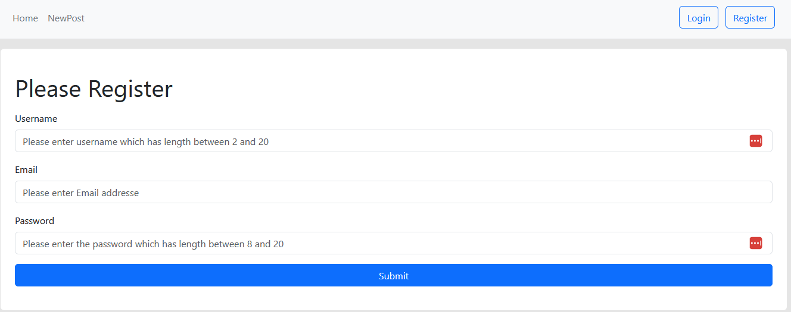
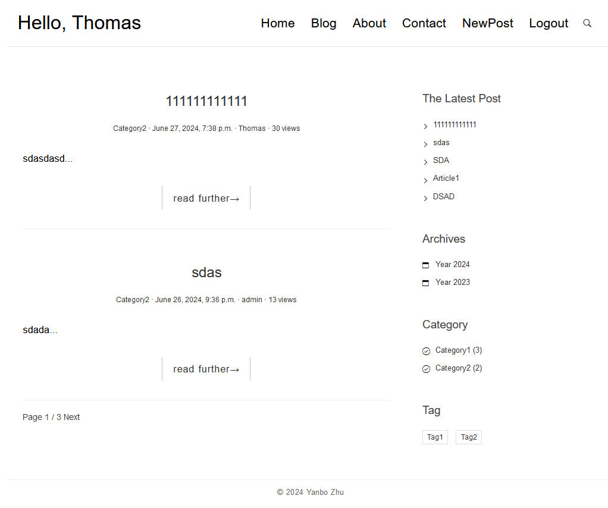
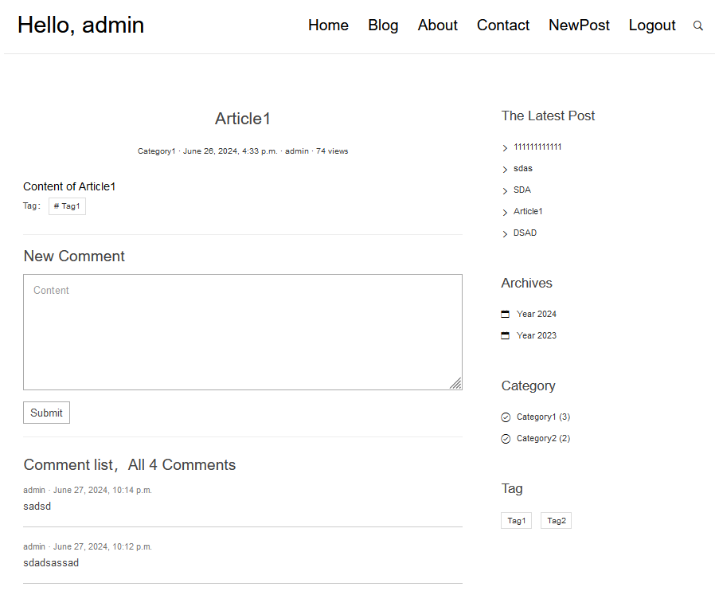
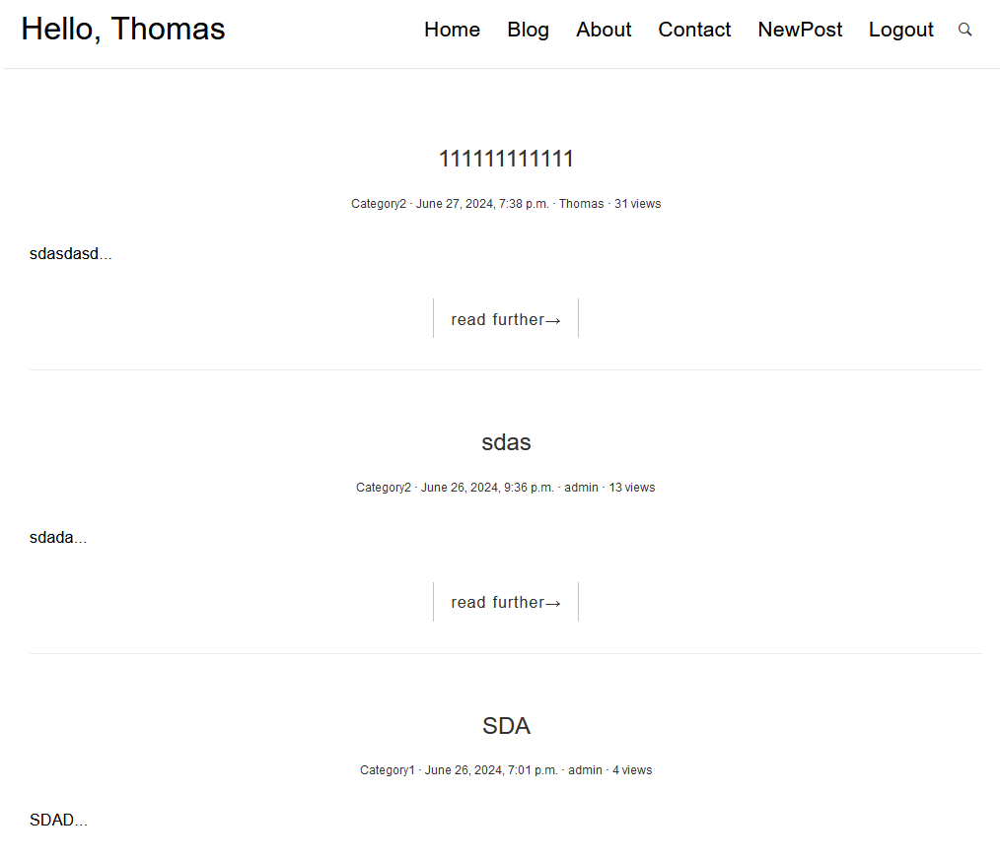
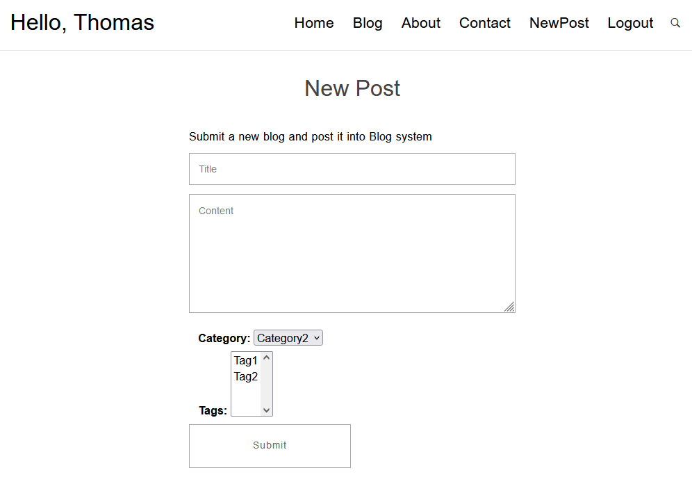
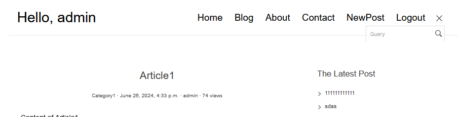
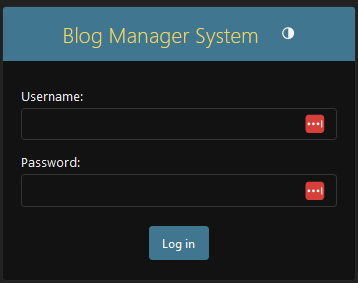

# 1 Blog_System

- [[#1.1 Projekt Description|1.1 Projekt Description]]
- [[#1.2 System Dependency|1.2 System Dependency]]
- [[#1.3 Depolyment process|1.3 Depolyment process]]
- [[#1.4 Main View|1.4 Main View]]
- [[#1.5 Database|1.5 Database]]
	- [[#1.5 Database#1.5.1 blog_user|1.5.1 blog_user]]
	- [[#1.5 Database#1.5.2 blog_app|1.5.2 blog_app]]
		- [[#1.5.2 blog_app#1.5.2.1 Table: Post|1.5.2.1 Table: Post]]
		- [[#1.5.2 blog_app#1.5.2.2 Table: Tag|1.5.2.2 Table: Tag]]
		- [[#1.5.2 blog_app#1.5.2.3 Table: Category|1.5.2.3 Table: Category]]
	- [[#1.5 Database#1.5.3 blog_comment|1.5.3 blog_comment]]
			- [[#1.5.2.3 Table: Category#1.5.3.1.1 Table: Comment|1.5.3.1.1 Table: Comment]]
- [[#1.6 Usage and Usecase|1.6 Usage and Usecase]]
	- [[#1.6 Usage and Usecase#1.6.1 Login and Register|1.6.1 Login and Register]]
		- [[#1.6.1 Login and Register#1.6.1.1 Authentication|1.6.1.1 Authentication]]
	- [[#1.6 Usage and Usecase#1.6.2 Payment Service|1.6.2 Payment Service]]
	- [[#1.6 Usage and Usecase#1.6.3 Blog System|1.6.3 Blog System]]
		- [[#1.6.3 Blog System#1.6.3.1 Home Page|1.6.3.1 Home Page]]
		- [[#1.6.3 Blog System#1.6.3.2 Post Detail Page and Comment|1.6.3.2 Post Detail Page and Comment]]
		- [[#1.6.3 Blog System#1.6.3.3 Blog List|1.6.3.3 Blog List]]
		- [[#1.6.3 Blog System#1.6.3.4 About me|1.6.3.4 About me]]
		- [[#1.6.3 Blog System#1.6.3.5 Post New|1.6.3.5 Post New]]
		- [[#1.6.3 Blog System#1.6.3.6 Search and Logout|1.6.3.6 Search and Logout]]
- [[#1.7 Administration System|1.7 Administration System]]
- [[#1.8 Restful API|1.8 Restful API]]
- [[#1.9 Other|1.9 Other]]

## 1.1 Projekt Description

Through this PHP project we can deploy a personal blog system.

This PHP project enables the deployment of a **personal blog system**, allowing users to create, manage, and share blog posts easily. The system is designed to be lightweight, user-friendly, and customizable. It serves as a great foundation for learning full-stack web development with PHP and relational Database.

**Key Features:**
- **User Authentication:** Secure login and registration system for authors/admins.
- **Post Management:** Create, edit, delete, and publish blog posts through an intuitive interface.
- **Comment System:** Visitors can leave comments on blog posts, optionally with moderation.
- **Categories & Tags:** Organize content using categories and tags for better discoverability.
- **Admin Dashboard:** Overview and controls for managing content, comments, and user accounts.    
- **Database Integration:** Uses MySQL or MariaDB to store content and user data efficiently.

## 1.2 System Dependency

PHP Framework: Laravel 

## 1.3 Depolyment process

1. How to depoly this project locally  
2. How to run this project 

## 1.4 Main View
- admin
  - [admin page](http://127.0.0.1:8000/admin): http://127.0.0.1:8000/admin
- blog_auth
  - [login](http://127.0.0.1:8000/auth/login): http://127.0.0.1:8000/auth/login
  - [register](http://127.0.0.1:8000/auth/register): http://127.0.0.1:8000/auth/register
  - [logout](http://127.0.0.1:8000/auth/logout): http://127.0.0.1:8000/auth/logout, logout the current user and redirect to the login page auotmatically
- blog_app
  - [Home Page](http://127.0.0.1:8000/blog/home): http://127.0.0.1:8000/blog/home
  - [Blog List](http://127.0.0.1:8000/blog/full): http://127.0.0.1:8000/blog/full
  - [About me](http://127.0.0.1:8000/blog/about/): http://127.0.0.1:8000/blog/about/
  - [Post new ](http://127.0.0.1:8000/blog/post/new/): http://127.0.0.1:8000/blog/post/new/
- blog_comment
  - [comment](http://127.0.0.1:8000/blog/comment/post/<post_pk>): http://127.0.0.1:8000/blog/comment/post/<post_pk>, show all comments of the post with the post_pk

## 1.5 Database

Postgresql and MongoDB is used as Database

### 1.5.1 blog_user 

The system defines **two main user groups**:

1. **Admin User (Super User):**  
    Admin Users have full access to all features of the system. They are capable of:
    - Creating, editing, and deleting any blog posts
    - Managing categories and tags
    - Moderating and deleting user comments
    - Managing user accounts (e.g., promoting users, deactivating accounts)
    - Accessing the admin dashboard and site settings
2. **Normal User:**  
    Normal Users have limited access and can:
    - View blog posts
    - Leave comments on posts
    - Create and manage their own profile (if enabled)
    - Optionally submit posts for review (depending on system settings

Example: 

| username | password | email                  | permission  |
| -------- | -------- | ---------------------- | ----------- |
| admin    | test123  | bigberlin100@gmail.com | superuser   |
| Thomas   | test123  | bigberlin200@gmail.com | normal user |
| Dylan    | test123  | bigberlin300@gmail.com | normal user |
| Jens     | test123  | bigberlin400@gmail.com | normal user |
| Florian  | test123  | bigberlin500@gmail.com | normal user |
|          |          |                        |             |

### 1.5.2 blog_app

#### 1.5.2.1 Table: Post
The Post in the Blog System

Attributes
- title: title of the post
- body: content of the post
- create_time: create time of the post
- modified_time: modified time of the post
- excerpt: if empty, the first 50 characters of body is used
- views: how many times this post is viewed
- category: As ForeignKey to table Category
- tags: mapping to the name in the table Tag
- author = As ForeignKey to table User

#### 1.5.2.2 Table: Tag
Tag of post

Attributes
- name: name of tag

#### 1.5.2.3 Table: Category
Category of post

Attributes
- name: name of category

### 1.5.3 blog_comment
##### 1.5.3.1.1 Table: Comment
Comment of post

Attributes
- author: ForeignKey to User
- email: email of the author
- url: url of the author
- text: content of the comment
- create_time: create time of the comment
- post: ForeignKey to Post

## 1.6 Usage and Usecase 

### 1.6.1 Login and Register

There are two page: login and register.

In the login mode, you can choose remember me or not. If you choose remember me, the session will be saved for 14 days. Otherwise, the session will expire after the browser is closed.

In the register mode, you need to set the username, the password and the email. The username and the email should be unique. The password should be at least 8 characters long. After you have registered, you will be redirected to the login page. you have to login with the username and the password you have just set.

Moreover, you can also enter to the Home page and The Page for creating new post directly through the main bar. Enter the Home page you don't need to login. But if you want to create a new post, you need to login first. Otherwise, you will be redirected to the login page.

#### 1.6.1.1 Authentication

Once you register a new user through Register page, this new created user will be registered into the User table. The password of the user is hashed by the built-in hash function. The password is not stored in the database directly.

The User below are available in the system. You can login with the username and the password below. Or you can also create a new user through the Register page.

### 1.6.2 Payment Service 

It must be integrated a payment service provider (e.g., Stripe or Paddle) so that at least one user group can subscribe to your application for a fee. It is sufficient if there is one purchasable license (e.g., 2 euros per month). (Note: To test payment service providers, there is a test mode or a sandbox available.)"

### 1.6.3 Blog System

There are five main pages in the blog system: Home Page, Blog List and About me, Contact me and Post new. They are all accessible through the main bar.

The welcome word "Hello, \<Username of current session\>" will be shown in the main bar if you have logged in.

#### 1.6.3.1 Home Page

The Blog are display in the link part of the Home Page. The first 3 posts are shown in the Home Page. You can click the title of the post to see the detail of the post.

The navigation bar is shown in the right side of the Home Page. The option blow are listed in the navigation bar:
- The latest 5 posts
- Archive: The posts are grouped by year
- category: The posts are grouped by category. you can click the category to see the posts in this category
- tag: The posts are grouped by tag. you can click the tag to see the posts in this tag

#### 1.6.3.2 Post Detail Page and Comment

The detail of the post is shown in the Detail Page of one Post. You can see the title, the author, the create time, the modified time, the category, the tags and the content of the post. 

The view number of the post is shown blow the title of the post. The view number will be increased by 1 every time you enter the detail page of the post.

The comments of the post are shown below the post. You can add a comment to the post if you have logged in. The comments are paginated by 10 comments per page. In order to add a comment, you have to login first. Otherwise, you will be redirected to the login page.

#### 1.6.3.3 Blog List
All Blog are shown in the Blog List. You can click the title of the post to see the detail of the post. The blogs are paginated by 10 posts per page.

#### 1.6.3.4 About me
The information about the author is shown in the About me page.

#### 1.6.3.5 Post New

if you want to create a new post, you need to login first. Otherwise, you will be redirected to the login page.

After you have already logged in, you can create a new post through the Post new page. You can set the title, the category, the tags and the content of the post. The category and the tags are selectable. You can also add a new category or several new tags. 

The Author of the post is the current user. The create time and the modified time of the post are set automatically. The excerpt of the post is the first 50 characters of the content, if you don't set the excerpt.

After you have created the post, you will be redirected to the detail page of the post.

#### 1.6.3.6 Search and Logout

In the main bar you can also search the post by title or content and logout the current user. Only the **title** and the **content** of the post will be searched.

After logout, you will be redirected to the login page.

## 1.7 Administration System

The administration system is accessible through the link of the admin page in the main bar. You can login with the superuser account or other user to manage the blog system.

The administration system is accessible through the link of the admin page in the main bar. You can login with the superuser account or other user to manage the blog system.

Blog Manger System Detail View:   TBD

## 1.8 Restful API

The Restful API is accessible through the link of the api page in the main bar. You can see all posts, categories, tags and users through the api page.

The result of the api is in JSON format. The api is paginated by 3 items per page.

you can filter the result by the following query parameters:
- posts: filter the posts by title
  - The verbose filter is also supported: e.g. http://127.0.0.1:8000/api/posts/?title=ad
- categories: filter the categories by name
- tags: filter the tags by name
- users: filter the users by username

## 1.9 Other
@Coding=UTF-8  
@Auther:Yanbo Zhu
@Time:2025-06  
@ProjectName:Personal Blog System